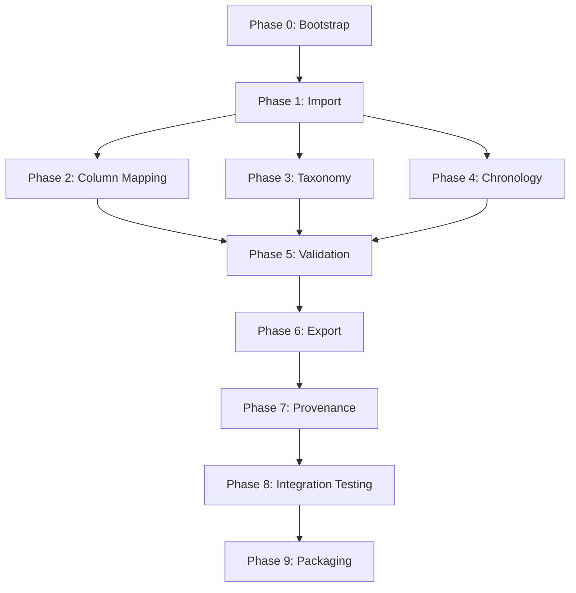

# IsoMap — Detailed Implementation Plan

> **Version:** 1.0 · **Date:** 2026-05-29 · **Author:** Marcus Quinn
> **Status:** Draft — Pending Review

---

## Executive Summary

IsoMap is an open-source desktop application that automates the standardisation, validation, and export of legacy isotopic and paleoecological datasets for submission to centralised repositories (Neotoma, IsoArcH, IsoMemo, PANGAEA). This plan details the phased implementation from project bootstrapping through MVP delivery, covering architecture, component design, testing, and deployment.

**Target:** MVP (v1.0) delivering end-to-end workflow for Neotoma and IsoArcH export.

---

## 1. Architecture Decision Records

### ADR-001: GUI Framework — Tauri + React with Python Sidecar

**Decision:** Use Tauri (Rust) with a React frontend and Python sidecar process for backend data logic.

**Rationale:**
- Aligns with sibling Digital Heritage Research projects (Libby, Paleo) which use FastAPI + React
- Tauri produces lightweight cross-platform binaries (~15 MB vs Electron's ~150 MB)
- Python sidecar handles Pandas, Pandera, taxonomy resolution, and ML model inference
- React provides modern component-based UI with excellent ecosystem
- Tauri's IPC (inter-process communication) bridges Rust ↔ Python via stdin/stdout JSON-RPC

**Alternative considered:** PySide6 (pure Python). Rejected because the UI would be less polished and harder to achieve the modern data-table interactions required for mapping/validation review. Retain as fallback if Tauri sidecar proves too complex.

**Trade-off:** Two-language stack (TypeScript + Python) increases complexity but is justified by superior UX.

---

### ADR-002: Offline-First with Opportunistic Online Enrichment

**Decision:** IsoMap operates fully offline using bundled data. When connectivity is detected, it opportunistically updates schemas and resolves taxonomy against live APIs.

**Rationale:**
- Researchers frequently work in remote field locations, mobile labs, and restricted-network environments
- All bundled components are small enough for desktop distribution:
  - all-MiniLM-L6-v2 embedding model: ~80 MB
  - GBIF backbone (filtered for palaeo-relevant taxa): ~500 MB as compressed SQLite
  - ITIS filtered snapshot: ~200 MB as SQLite
  - IntCal20/SHCal20/Marine20 calibration curves: ~5 MB
  - Repository JSON Schema files: <1 MB
- GitHub-hosted schema registry polled on launch for updates

---

### ADR-003: Validation Framework — Pandera

**Decision:** Use Pandera for DataFrame-native validation.

**Rationale:**
- Pandera is lightweight, DataFrame-native, and supports vectorized checks
- Pydantic is too heavyweight for row-by-row DataFrame validation
- Great Expectations is enterprise-grade overkill for a desktop app
- Pandera supports custom check functions for domain-specific rules (C:N ratios, collagen yield, diagenesis indicators)
- Generates programmatic validation reports that can be formatted into user-facing summaries

---

### ADR-004: Schema Matching Pipeline — Hierarchical Fallback

**Decision:** Implement a 6-stage hierarchical matching pipeline (exact → dictionary → fuzzy → embedding → value distribution → manual).

**Rationale:**
- No single matching approach works for all column name variations in legacy palaeoscience data
- Exact and fuzzy matching catch 60-70% of cases cheaply
- Embedding similarity (all-MiniLM-L6-v2) catches domain-specific semantic equivalences ("horizon" = "depth", "14C_BP_uncal" = "Radiocarbon Age")
- Value distribution profiling catches cases where column names are meaningless but data patterns are diagnostic (values between −25‰ and −10‰ → δ13C)
- User overrides are cached in SQLite for learning across sessions

---

### ADR-005: Taxonomy Resolution — Target-First Fallback Chain

**Decision:** Resolve taxonomy against the target repository's internal authority first, then fall back to progressively broader authorities.

**Resolution chain:**
1. **Neotoma internal taxonomy** (`/v2.0/data/taxa`) — when targeting Neotoma
2. **GBIF Species Match** — broadest modern biodiversity coverage
3. **ITIS Solr** — North American focus, government-maintained
4. **WoRMS** — marine taxa (foraminifera, diatoms, ostracodes)
5. **PBDB** — extinct/fossil taxa not in modern registries
6. **User custom dictionary** — cached manual resolutions

**Rationale:** Neotoma's internal taxonomy is NOT identical to GBIF or ITIS. Submitting a GBIF-accepted name that Neotoma doesn't recognise causes rejection. Target-first resolution prevents this.

---

### ADR-006: Provenance — Frictionless Data with Optional PROV-O

**Decision:** Use Frictionless Data framework for primary provenance tracking; offer PROV-O/RO-Crate as optional advanced export.

**Rationale:**
- Frictionless Data's `datapackage.json` + `pipeline.yaml` provides adequate provenance for FAIR compliance with lower implementation overhead than full RDF/PROV-O graphs
- Sequential JSON audit logs (OpenRefine-style) are human-readable and machine-replayable
- PROV-O/RO-Crate packaging can be offered as an optional export format for journals requiring it (ESSD, JOAD)

---

## 2. Component Architecture

```
isomap/
├── pyproject.toml                    # Python project metadata, dependencies
├── src/
│   ├── isomap/                       # Python package (sidecar backend)
│   │   ├── __init__.py
│   │   ├── main.py                   # JSON-RPC server for Tauri IPC
│   │   ├── core/
│   │   │   ├── __init__.py
│   │   │   ├── importer.py           # CSV/Excel import engine
│   │   │   ├── mapper.py             # Column mapping pipeline
│   │   │   ├── taxonomy.py           # Taxonomy resolution engine
│   │   │   ├── chronology.py         # Date format normalisation
│   │   │   ├── validator.py          # Pandera validation engine
│   │   │   ├── exporter.py           # Repository-specific export generators
│   │   │   └── provenance.py         # Transformation audit log
│   │   ├── matching/
│   │   │   ├── __init__.py
│   │   │   ├── exact.py              # Normalised exact match
│   │   │   ├── fuzzy.py              # rapidfuzz string similarity
│   │   │   ├── semantic.py           # all-MiniLM-L6-v2 embedding similarity
│   │   │   ├── distribution.py       # Value distribution profiling
│   │   │   └── preferences.py        # User preference SQLite cache
│   │   ├── taxonomy/
│   │   │   ├── __init__.py
│   │   │   ├── gbif.py               # GBIF Species Match API client
│   │   │   ├── itis.py               # ITIS Solr API client
│   │   │   ├── worms.py              # WoRMS REST API client
│   │   │   ├── pbdb.py               # PBDB API client
│   │   │   ├── neotoma.py            # Neotoma internal taxonomy client
│   │   │   ├── offline.py            # SQLite/DuckDB offline taxonomy store
│   │   │   └── resolver.py           # Hierarchical resolution orchestrator
│   │   ├── validation/
│   │   │   ├── __init__.py
│   │   │   ├── schemas.py            # Pandera schema definitions
│   │   │   ├── isotopic.py           # Isotope-specific validation rules
│   │   │   ├── spatial.py            # CRS and coordinate validation
│   │   │   ├── collagen.py           # Bone collagen quality indicators
│   │   │   ├── carbonate.py          # Carbonate diagenesis screening
│   │   │   └── report.py             # Validation report generator
│   │   ├── export/
│   │   │   ├── __init__.py
│   │   │   ├── neotoma.py            # Neotoma YAML crosswalk + CSV generation
│   │   │   ├── isoarch.py            # IsoArcH Excel template population
│   │   │   ├── pangaea.py            # PANGAEA TAB-delimited export (v2)
│   │   │   └── lipd.py               # LiPD JSON-LD export (v2)
│   │   ├── schemas/                  # JSON Schema definitions (versioned)
│   │   │   ├── neotoma_v2.json
│   │   │   ├── isoarch_v1.json
│   │   │   └── registry.py           # GitHub schema registry updater
│   │   └── models/
│   │       ├── __init__.py
│   │       ├── dataset.py            # Dataset data model
│   │       ├── mapping.py            # ColumnMapping, TaxonMapping models
│   │       ├── validation.py         # ValidationIssue model
│   │       └── log.py                # TransformationLog model
│   └── ui/                           # Tauri + React frontend
│       ├── src-tauri/                # Tauri Rust backend
│       │   ├── Cargo.toml
│       │   ├── tauri.conf.json
│       │   └── src/
│       │       └── main.rs           # Tauri app entry + Python sidecar management
│       ├── src/                      # React frontend
│       │   ├── App.tsx
│       │   ├── components/
│       │   │   ├── ImportWizard/     # Data import step
│       │   │   ├── ColumnMapper/     # Interactive column mapping review
│       │   │   ├── TaxonomyReview/   # Taxonomy resolution review
│       │   │   ├── ValidationReport/ # Validation results dashboard
│       │   │   ├── ExportConfig/     # Repository selection + export
│       │   │   └── common/           # Shared UI components
│       │   ├── hooks/
│       │   ├── stores/               # State management
│       │   └── styles/
│       ├── package.json
│       └── vite.config.ts
├── data/                             # Bundled offline data
│   ├── taxonomy/                     # Pre-processed taxonomy snapshots
│   │   ├── gbif_paleo_subset.db      # SQLite/DuckDB (~500 MB)
│   │   └── itis_filtered.db          # SQLite (~200 MB)
│   ├── schemas/                      # Repository JSON Schema files
│   ├── calibration/                  # IntCal20, SHCal20, Marine20 curves
│   └── models/                       # ML model weights
│       └── all-MiniLM-L6-v2/        # Sentence transformer (~80 MB)
├── tests/
│   ├── conftest.py
│   ├── test_data/                    # Test spreadsheets (real and synthetic)
│   ├── test_importer.py
│   ├── test_mapper.py
│   ├── test_taxonomy.py
│   ├── test_validator.py
│   ├── test_exporter.py
│   └── integration/
│       ├── test_neotoma_workflow.py
│       └── test_isoarch_workflow.py
└── docs/
    ├── SCOPE.md                      # Project scoping document
    ├── PLAN.md                       # This document
    ├── scope.md                      # Original scope (preserved)
    └── research-papers/              # Research outputs
```

---

## 3. Phased Implementation Plan

### Phase 0: Project Bootstrap (Week 1)

> **Goal:** Establish project infrastructure, development environment, and CI foundation.

| Task | Description | Estimate |
|---|---|---|
| P0.1 | Initialize Python project with `pyproject.toml` (deps: pandas, pandera, rapidfuzz, sentence-transformers, openpyxl, pyproj, shapely, pydantic) | ~2h |
| P0.2 | Initialize Tauri project with React + Vite frontend | ~2h |
| P0.3 | Set up Python sidecar communication (JSON-RPC over stdin/stdout) | ~4h |
| P0.4 | Configure pytest, pre-commit hooks, ruff linter | ~1h |
| P0.5 | Create test data directory with 3-5 representative legacy spreadsheets (synthetic + real anonymised) | ~2h |
| P0.6 | Set up GitHub repository with CI (pytest on push, lint checks) | ~1h |
| P0.7 | Create initial JSON Schema files for Neotoma and IsoArcH target schemas | ~4h |

**Deliverable:** Working project skeleton — Tauri app launches, React frontend renders, Python sidecar responds to JSON-RPC calls.

---

### Phase 1: Import Engine (Week 2)

> **Goal:** Reliably import CSV and Excel files with automatic column type inference.

| Task | Description | Estimate |
|---|---|---|
| P1.1 | `importer.py` — CSV import with encoding detection (chardet/charset-normalizer) | ~2h |
| P1.2 | `importer.py` — Excel import via openpyxl (`.xlsx`) and xlrd (`.xls`), multi-sheet support | ~2h |
| P1.3 | Column type inference engine — detect numeric, string, date, coordinate, isotope value, taxon name columns using regex + statistical heuristics | ~4h |
| P1.4 | `ImportWizard` React component — file picker, sheet selector, preview table with inferred types | ~4h |
| P1.5 | Wire import flow through Tauri IPC | ~2h |
| P1.6 | Unit tests for import engine (encodings, edge cases, malformed files) | ~2h |

**Deliverable:** User can import a CSV or Excel file and see a preview with auto-detected column types.

---

### Phase 2: Column Mapping Engine (Weeks 3–4)

> **Goal:** Implement the hierarchical 6-stage column mapping pipeline with interactive review UI.

| Task | Description | Estimate |
|---|---|---|
| P2.1 | `exact.py` — Normalised exact match (strip whitespace, lowercase, remove special chars) | ~1h |
| P2.2 | `preferences.py` — SQLite user preference cache (store + retrieve previous manual mappings) | ~2h |
| P2.3 | `fuzzy.py` — rapidfuzz Jaro-Winkler + Levenshtein with configurable thresholds | ~2h |
| P2.4 | `semantic.py` — Sentence transformer embedding similarity using all-MiniLM-L6-v2 | ~4h |
| P2.5 | Pre-compute and cache target schema embeddings for Neotoma and IsoArcH field names | ~2h |
| P2.6 | `distribution.py` — Value distribution profiling (identify δ13C, δ15N, ¹⁴C BP, coordinates by value ranges) | ~4h |
| P2.7 | `mapper.py` — Orchestrate 6-stage pipeline, compute aggregate confidence scores, rank suggestions | ~4h |
| P2.8 | `ColumnMapper` React component — interactive mapping review table (source → suggested target, confidence bars, override dropdown) | ~6h |
| P2.9 | Store user overrides back to SQLite preference cache for future sessions | ~1h |
| P2.10 | Unit tests for each matching stage + integration tests for full pipeline | ~4h |

**Deliverable:** User sees ranked column mapping suggestions with confidence scores. Can accept, reject, or override each suggestion. Overrides are cached for learning.

---

### Phase 3: Taxonomy Resolution Engine (Weeks 5–6)

> **Goal:** Resolve arbitrary taxon name strings against authority APIs with offline fallback.

| Task | Description | Estimate |
|---|---|---|
| P3.1 | `gbif.py` — GBIF Species Match API client (async HTTP, parse JSON response, handle EXACT/FUZZY/HIGHERRANK/NONE) | ~3h |
| P3.2 | `itis.py` — ITIS Solr API client (search by scientific name, get accepted name from TSN synonym) | ~3h |
| P3.3 | `worms.py` — WoRMS REST API client (AphiaRecordsByMatchNames, TAXAMATCH fuzzy matching) | ~2h |
| P3.4 | `pbdb.py` — PBDB taxa API client (extinct/fossil taxa resolution) | ~2h |
| P3.5 | `neotoma.py` — Neotoma internal taxonomy API client (`/v2.0/data/taxa`) | ~2h |
| P3.6 | `offline.py` — SQLite/DuckDB offline taxonomy store with full-text search index | ~4h |
| P3.7 | Script to pre-process GBIF backbone download into filtered palaeo-relevant SQLite snapshot | ~4h |
| P3.8 | `resolver.py` — Hierarchical resolution orchestrator (target-first fallback chain, synonymy chain handling) | ~6h |
| P3.9 | `TaxonomyReview` React component — resolution results table with authority source, confidence, accept/reject/override per taxon | ~4h |
| P3.10 | Handle conflicting resolutions between authorities (surface to user for manual decision) | ~2h |
| P3.11 | Store custom resolutions in local SQLite dictionary | ~1h |
| P3.12 | Unit tests for each API client + integration tests for resolver chain | ~4h |

**Deliverable:** User's taxon names are resolved against multiple authorities. Unresolved and conflicting names are surfaced for manual review.

---

### Phase 4: Chronology Normalisation (Week 7)

> **Goal:** Parse and normalise heterogeneous date formats to target repository requirements.

| Task | Description | Estimate |
|---|---|---|
| P4.1 | `chronology.py` — Date format detection (regex-based: ¹⁴C BP, cal BP, cal BCE/CE, ka, Ma, period names) | ~4h |
| P4.2 | Calendar convention normalisation (BP ↔ cal BP ↔ BCE/CE, with 1950 CE anchor) | ~2h |
| P4.3 | Map to Neotoma's `ChronControls` and `SampleAges` table structures (quantile-based age distributions) | ~4h |
| P4.4 | Controlled vocabulary mapping for dating methods and stratigraphic periods | ~2h |
| P4.5 | Handle missing calibration data (flag, don't block) | ~1h |
| P4.6 | Unit tests for date parsing across 20+ real-world format variants | ~3h |

**Deliverable:** Heterogeneous date columns are normalised to target repository format with clear provenance of conversion method.

---

### Phase 5: Validation Engine (Weeks 8–9)

> **Goal:** Implement comprehensive Pandera-based validation with tiered severity and user-friendly reporting.

| Task | Description | Estimate |
|---|---|---|
| P5.1 | `schemas.py` — Pandera DataFrameSchema definitions for Neotoma and IsoArcH target schemas | ~4h |
| P5.2 | `isotopic.py` — Isotope-specific validation rules (δ13C: −35‰ to +5‰; δ15N: −5‰ to +25‰; reference scale compliance VPDB/AIR/VCDT/VSMOW) | ~3h |
| P5.3 | `collagen.py` — Bone collagen quality validation (C:N 2.9–3.6, %C >30%, %N >11%, yield >1%; sulphur: %S 0.15–0.35%, C/S 300–900, N/S 100–300 for mammals; separate thresholds for fish) | ~3h |
| P5.4 | `carbonate.py` — Carbonate diagenesis checks (FTIR splitting factor, XRD index, Mn/Fe ratios) | ~2h |
| P5.5 | `spatial.py` — CRS detection and transformation (pyproj, `always_xy=True`), point-in-polygon land/ocean check (shapely + geopandas with Natural Earth coastline shapefile) | ~4h |
| P5.6 | Cross-field logical consistency checks (e.g., if material = "bone collagen" → C:N must exist; calibrated age < 50,000 BP for ¹⁴C) | ~3h |
| P5.7 | Controlled vocabulary compliance checks against loaded JSON Schema vocabulary lists | ~2h |
| P5.8 | Duplicate detection (sample IDs, coordinates within dataset) | ~2h |
| P5.9 | `report.py` — Validation report generator (aggregate by type+column, severity classification: Blocking/Warning/Info) | ~3h |
| P5.10 | `ValidationReport` React component — dashboard summary with error counts by category, click-through to filtered DataFrame view of offending rows | ~6h |
| P5.11 | Unit tests for each validation module with edge cases (boundary values, missing data, mixed material types) | ~4h |

**Deliverable:** Comprehensive validation engine producing tiered reports. Users can drill from summary → individual offending rows. Blocking errors prevent export.

---

### Phase 6: Export Engine (Weeks 10–11)

> **Goal:** Generate repository-specific submission files from validated, mapped data.

| Task | Description | Estimate |
|---|---|---|
| P6.1 | `neotoma.py` — Generate Neotoma DataBUS YAML crosswalk template (`apiVersion: neotoma v2.0`, with `column`, `neotoma`, `vocab`, `repeat`, `type`, `ordered` fields) | ~4h |
| P6.2 | `neotoma.py` — Generate mapped CSV file with columns renamed to Neotoma schema paths | ~2h |
| P6.3 | `neotoma.py` — Pivot flat spreadsheet into Neotoma's hierarchical structure (Site → CollectionUnit → AnalysisUnit → Sample → Data) | ~6h |
| P6.4 | `isoarch.py` — Load IsoArcH Excel template, populate cells with mapped + validated data, enforce dropdown vocabulary constraints | ~6h |
| P6.5 | `ExportConfig` React component — repository selector, export preview, file save dialog | ~3h |
| P6.6 | Integration tests: import → map → validate → export roundtrip for Neotoma and IsoArcH | ~4h |

**Deliverable:** User can export validated datasets as Neotoma YAML+CSV or pre-filled IsoArcH Excel templates.

---

### Phase 7: Provenance & Audit Log (Week 12)

> **Goal:** Generate reproducible transformation audit logs and methods documentation.

| Task | Description | Estimate |
|---|---|---|
| P7.1 | `provenance.py` — Sequential JSON audit log capturing: input file hash (SHA-256), column mappings, taxonomy resolutions, unit conversions, validation overrides | ~4h |
| P7.2 | Make audit log replayable (a collaborator can load the JSON and re-apply transformations to updated source data) | ~3h |
| P7.3 | Auto-generate prose methodology snippet (suitable for data paper supplementary methods) | ~2h |
| P7.4 | Frictionless Data Package export (`datapackage.json` manifest + `pipeline.yaml`) | ~3h |
| P7.5 | Unit tests for audit log generation and replay | ~2h |

**Deliverable:** Every transformation is documented in a machine-readable, human-readable JSON log. Methods snippet auto-generated.

---

### Phase 8: Integration Testing & Polish (Weeks 13–14)

> **Goal:** End-to-end testing with real datasets, UX polish, and bug fixes.

| Task | Description | Estimate |
|---|---|---|
| P8.1 | End-to-end test with 3 real Neotoma-bound datasets (obtain from public Neotoma DataBUS examples) | ~4h |
| P8.2 | End-to-end test with 3 real IsoArcH-bound datasets (obtain from IsoArcH template examples) | ~4h |
| P8.3 | Submit test outputs to Neotoma DataBUS holding database (with Neotoma IT coordination) | ~2h |
| P8.4 | Submit test outputs via IsoArcH web form validation | ~2h |
| P8.5 | UX polish — loading states, error recovery, keyboard navigation, accessibility | ~6h |
| P8.6 | Performance profiling — ensure <5s for import, <10s for mapping, <30s for taxonomy resolution on datasets with 1000+ rows | ~3h |
| P8.7 | Fix bugs identified during integration testing | ~8h |
| P8.8 | Documentation — README, user guide, API reference | ~4h |

**Deliverable:** MVP validated against real repository submission workflows.

---

### Phase 9: Packaging & Distribution (Week 15)

> **Goal:** Cross-platform desktop app packaging and distribution.

| Task | Description | Estimate |
|---|---|---|
| P9.1 | Configure Tauri build for Windows, macOS, and Linux | ~4h |
| P9.2 | Bundle Python sidecar with PyInstaller/PyOxidizer inside Tauri binary | ~6h |
| P9.3 | Bundle offline data (taxonomy SQLite, ML model, schemas, calibration curves) | ~2h |
| P9.4 | Configure auto-update mechanism for schema registry (check GitHub on launch) | ~2h |
| P9.5 | Create GitHub Releases with platform-specific installers | ~2h |
| P9.6 | Smoke test on Windows 10+, macOS 12+, Ubuntu 22.04+ | ~4h |

**Deliverable:** Downloadable installers for Windows, macOS, and Linux. Fully offline-capable.

---

## 4. Dependency Matrix



**Critical path:** P0 → P1 → P2 → P5 → P6 → P8 → P9

**Parallelisable:** P2, P3, P4 can run concurrently after P1 completes.

---

## 5. Key Technical Specifications

### 5.1 Neotoma YAML Crosswalk Template Format

IsoMap must generate YAML files matching this structure (as used by DataBUS):

```yaml
apiVersion: neotoma v2.0
kind: development
metadata:
  - column: "SiteName"
    neotoma: "ndb.sites.sitename"
    vocab: false
    repeat: true
    type: string
    ordered: false
  - column: "Latitude"
    neotoma: "ndb.sites.latitudenorth"
    vocab: false
    repeat: true
    type: numeric
    ordered: false
  - column: "Depth_cm"
    neotoma: "ndb.analysisunits.depth"
    vocab: false
    repeat: false
    type: numeric
    ordered: true
  - column: "Pinus"
    neotoma: "ndb.data.value"
    vocab: ["ndb.taxa.taxonname"]
    repeat: false
    type: integer
    ordered: false
```

### 5.2 Isotope Quality Validation Thresholds

| Material | Metric | Valid Range | Severity if Violated |
|---|---|---|---|
| Bone collagen (mammal/bird) | C:N atomic ratio | 2.9 – 3.6 | 🔴 Blocking |
| Bone collagen (mammal/bird) | Collagen yield | > 1% | 🟡 Warning |
| Bone collagen (mammal/bird) | %C | > 30% | 🟡 Warning |
| Bone collagen (mammal/bird) | %N | > 11% | 🟡 Warning |
| Bone collagen (mammal/bird) | %S | 0.15% – 0.35% | 🟡 Warning |
| Bone collagen (mammal/bird) | C/S atomic ratio | 300 – 900 | 🟡 Warning |
| Bone collagen (mammal/bird) | N/S atomic ratio | 100 – 300 | 🟡 Warning |
| Fish bone collagen | %S | 0.40% – 0.80% | 🟡 Warning |
| Fish bone collagen | C/S | 125 – 225 | 🟡 Warning |
| Fish bone collagen | N/S | 40 – 80 | 🟡 Warning |
| Enamel bioapatite | FTIR splitting factor | Report if available | 🔵 Info |
| Any carbonate | Mn/Fe ratio | Report if available | 🔵 Info |
| δ13C (bone collagen) | Value range | −35‰ to +5‰ VPDB | 🟡 Warning |
| δ15N | Value range | −5‰ to +25‰ AIR | 🟡 Warning |
| δ18O (carbonate) | Value range | −15‰ to +5‰ VPDB | 🟡 Warning |
| δ34S | Value range | −10‰ to +25‰ VCDT | 🟡 Warning |
| ⁸⁷Sr/⁸⁶Sr | Value range | 0.700 – 0.750 | 🟡 Warning |
| ¹⁴C BP (uncalibrated) | Value range | 0 – 55,000 | 🟡 Warning |

### 5.3 Column Type Detection Heuristics

| Pattern | Detected Type | Confidence Signal |
|---|---|---|
| Values clustered −25‰ to −10‰ | δ13C (C3 ecosystem) | High |
| Values clustered −12‰ to −8‰ | δ13C (C4/mixed) | Medium |
| Values clustered 0‰ to 20‰ | δ15N | High |
| Values clustered −15‰ to +5‰ | δ18O | Medium |
| Values clustered 0.700 to 0.750 | ⁸⁷Sr/⁸⁶Sr | High |
| Positive integers 1,000–55,000 | ¹⁴C BP (uncalibrated) | High |
| Values 2.5 to 4.5 | C:N atomic ratio | High |
| Decimal degrees −90 to 90 | Latitude | High |
| Decimal degrees −180 to 180 | Longitude | High |
| Strings matching genus+species pattern | Taxon name | Medium |
| Lab code pattern (e.g., OxA-12345) | Radiocarbon lab code | High |

### 5.4 Taxonomic API Response Parsing

#### GBIF Species Match

```
GET https://api.gbif.org/v1/species/match?name=Passer+domesticus&verbose=true

Response → extract:
  usageKey      → authority_id
  matchType     → match_type (EXACT, FUZZY, HIGHERRANK, NONE)
  confidence    → match_score (0–100)
  status        → ACCEPTED or SYNONYM
  synonym       → boolean, triggers synonymy chain lookup
  acceptedUsageKey → if synonym, resolve to this key
```

#### ITIS Solr

```
GET https://services.itis.gov/ITISService/searchByScientificName?srchKey=Mammuthus+primigenius&wt=json

Response → extract:
  tsn           → authority_id (Taxonomic Serial Number)
  nameUsage     → "valid" or "not accepted"
  If "not accepted" → call getAcceptedNamesFromTSN(tsn) to resolve
```

---

## 6. Risk Register

| ID | Risk | Likelihood | Impact | Mitigation | Owner |
|---|---|---|---|---|---|
| R1 | Neotoma changes API or holding DB structure | Medium | High | Version-pinned schema registry; monitor Neotoma GitHub repos | Dev |
| R2 | IsoArcH template format changes | Medium | Medium | Template-versioned export; maintain multiple template versions | Dev |
| R3 | GBIF backbone too large for bundled distribution | High | Medium | Filter to palaeo-relevant taxa only; compress SQLite with zstd | Dev |
| R4 | Tauri + Python sidecar IPC latency | Low | Medium | Profile early; consider embedded Python (PyO3) if unacceptable | Dev |
| R5 | Conflicting taxonomy between authorities | Certain | Low | Surface conflicts to user with clear authority labels; never auto-resolve conflicts silently | Dev |
| R6 | Legacy dates in unrecognisable format | High | Medium | Generous regex library; fallback to manual annotation; log unresolved dates | Dev |
| R7 | Cross-platform packaging fails on one OS | Medium | High | CI builds on all three OSes from Phase 0; smoke test weekly | Dev |
| R8 | Neotoma steward rejects tool-generated output | Medium | High | Collaborate with Neotoma IT working group early; follow DataBUS YAML format exactly | Dev |
| R9 | ML model inference too slow on low-end hardware | Low | Medium | all-MiniLM-L6-v2 is optimised for CPU; pre-compute schema embeddings; lazy-load model | Dev |
| R10 | Researcher distrust of automated mapping | Medium | Medium | Always show confidence scores; never auto-submit without user review; "explain this suggestion" UX | Dev |

---

## 7. Success Metrics

| Metric | Target | Measurement Method |
|---|---|---|
| Column mapping precision | ≥ 85% correct top-1 suggestions | Benchmark against 10 annotated test datasets |
| Column mapping recall | ≥ 90% of mappable columns get a suggestion | Same benchmark |
| Taxonomy auto-resolution rate | ≥ 90% resolved without manual intervention | Count unresolved taxa across test datasets |
| Validation coverage | 100% of known Neotoma/IsoArcH rejection reasons | Map rejection types to validation rules |
| Export acceptance rate | 100% pass DataBUS validation; 100% pass IsoArcH template validation | Submit test outputs |
| Import success rate | 100% for well-formed CSV/Excel; ≥ 95% for malformed files with graceful degradation | Test across encoding and format variants |
| Performance (1000-row dataset) | Import < 5s, mapping < 10s, validation < 5s, export < 5s | Profiling on reference hardware |
| Offline operation | Full workflow completes without network | Test in airplane mode |

---

## 8. External Collaboration & Ecosystem Synergies

| Stakeholder / Project | Purpose | Timing |
|---|---|---|
| **Neotoma IT Working Group** | Obtain DataBUS holding database write credentials; validate YAML template format; understand validation rules | Before Phase 6 |
| **IsoArcH Team** | Obtain current template versions; verify controlled vocabulary lists; test submission pipeline | Before Phase 6 |
| **Libby Project** (sibling) | Integrate IntCal20 calibration engine as sidecar service, reuse SQLite curve registry, and adapt GIS curve selector logic. | Phase 4 or later |
| **Paleo Project** (sibling) | Import Neotoma/PBDB/PANGAEA harvest scripts for taxonomy generation and reuse geochemical proxy models. | Phase 3 |
| **HOARD Project** (sibling) | Adapt ARK Direct Data Input module for Phase 1 structured data import. | Phase 1 |
| **StratiGraph Project** | Align exported stratigraphic constraints with HMDP JSON schema for cross-validation. | Phase 6 |
| **Domain researchers** (3-5 beta testers) | Test with real legacy datasets; identify UX pain points; validate mapping accuracy | Phase 8 |

---

## 9. Timeline Summary

| Phase | Weeks | Description | Deliverable |
|---|---|---|---|
| **Phase 0** | Week 1 | Project bootstrap | Working skeleton |
| **Phase 1** | Week 2 | Import engine | CSV/Excel import with type inference |
| **Phase 2** | Weeks 3–4 | Column mapping | 6-stage pipeline with interactive review |
| **Phase 3** | Weeks 5–6 | Taxonomy resolution | Multi-authority resolver with offline fallback |
| **Phase 4** | Week 7 | Chronology normalisation | Date format parsing and conversion |
| **Phase 5** | Weeks 8–9 | Validation engine | Pandera schemas with tiered reporting |
| **Phase 6** | Weeks 10–11 | Export engine | Neotoma YAML+CSV, IsoArcH Excel |
| **Phase 7** | Week 12 | Provenance & audit | JSON audit log, Frictionless Data Package |
| **Phase 8** | Weeks 13–14 | Integration testing | Validated against real submission workflows |
| **Phase 9** | Week 15 | Packaging & distribution | Cross-platform installers |

**Total estimated duration:** ~15 weeks for MVP (v1.0)

---

## 10. Post-MVP Roadmap

| Version | Focus | Key Features |
|---|---|---|
| **v1.1** | Quality of life | Batch processing, improved UX feedback, performance optimisation |
| **v2.0** | Extended repositories | PANGAEA, NOAA, LiPD export; CRS transformation (pyproj) |
| **v2.1** | Advanced ML | SciBERT embeddings, Valentine ensemble matching, learned column profiles |
| **v3.0** | Calibration & provenance | Integrated radiocarbon calibration (Libby sidecar), RO-Crate/PROV-O, data paper generation |
| **v3.1** | Ecosystem | ORCID integration, DOI tracking, unit normalisation (Pint), collaborative workflows |

---

## Appendix A: Python Dependencies (pyproject.toml)

```toml
[project]
name = "isomap"
version = "0.1.0"
requires-python = ">=3.12"

[project.dependencies]
pandas = ">=2.2"
openpyxl = ">=3.1"
xlrd = ">=2.0"
pandera = ">=0.20"
rapidfuzz = ">=3.9"
sentence-transformers = ">=3.0"
pydantic = ">=2.8"
httpx = ">=0.27"
chardet = ">=5.2"
pyproj = ">=3.6"
shapely = ">=2.0"
geopandas = ">=1.0"

[project.optional-dependencies]
dev = [
    "pytest>=8.0",
    "pytest-asyncio>=0.24",
    "ruff>=0.6",
    "pre-commit>=3.8",
]
```

## Appendix B: Glossary

| Term | Definition |
|---|---|
| **¹⁴C BP** | Radiocarbon years Before Present (Present = 1950 CE) |
| **cal BP** | Calibrated years Before Present |
| **δ13C** | Stable carbon isotope ratio (¹³C/¹²C) relative to VPDB standard |
| **δ15N** | Stable nitrogen isotope ratio (¹⁵N/¹⁴N) relative to atmospheric nitrogen |
| **δ18O** | Stable oxygen isotope ratio (¹⁸O/¹⁶O) relative to VPDB or VSMOW |
| **⁸⁷Sr/⁸⁶Sr** | Strontium isotope ratio (radiogenic/stable) |
| **C:N ratio** | Atomic carbon-to-nitrogen ratio in collagen (quality indicator) |
| **CIDOC-CRM** | Conceptual Reference Model for cultural heritage (ISO 21127) |
| **DataBUS** | Neotoma's Python-based bulk upload mechanism |
| **FAIR** | Findable, Accessible, Interoperable, Reusable (data principles) |
| **CARE** | Collective benefit, Authority to control, Responsibility, Ethics |
| **Frictionless Data** | JSON-based data packaging standard for tabular data |
| **IsoArcH** | International open-access bioarchaeological isotopic data repository |
| **IsoMemo** | Federated network of isotopic databases |
| **LiPD** | Linked Paleo Data — universal paleoclimate data container |
| **Neotoma** | International multiproxy paleoecological database |
| **Pandera** | Python DataFrame validation library |
| **PANGAEA** | Data Publisher for Earth & Environmental Science |
| **PROV-O** | W3C Provenance Ontology |
| **RO-Crate** | Research Object Crate (provenance packaging standard) |
| **VPDB** | Vienna Pee-Dee-Belemnite (carbon/oxygen isotope standard) |
| **WoRMS** | World Register of Marine Species |
